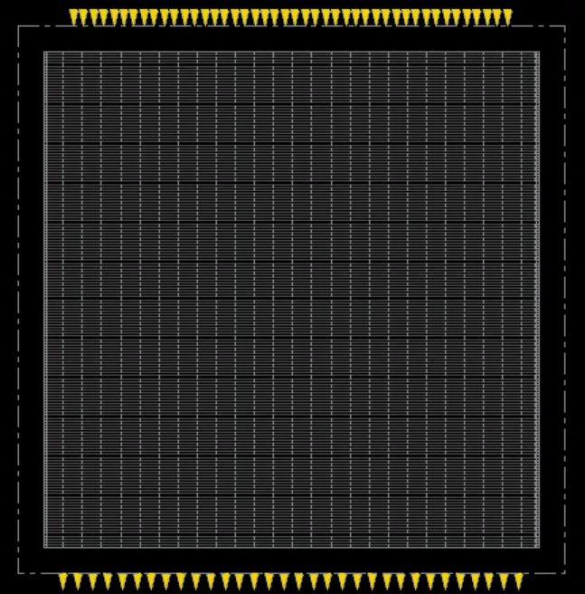
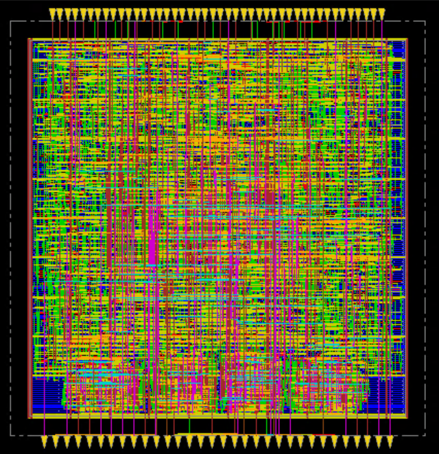
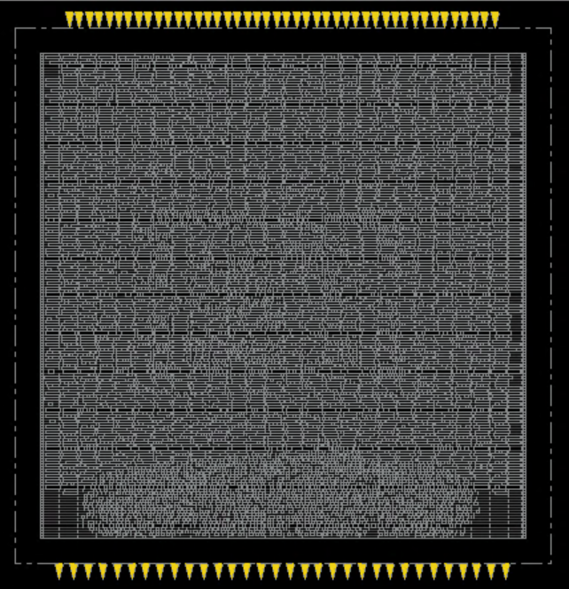
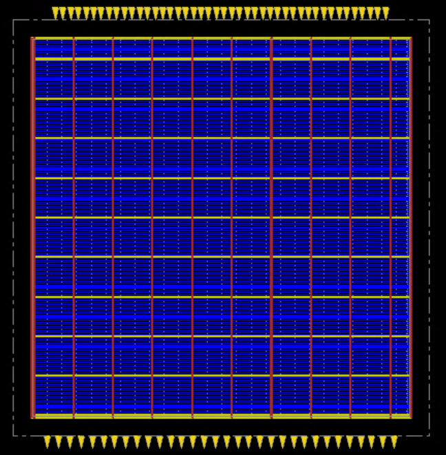
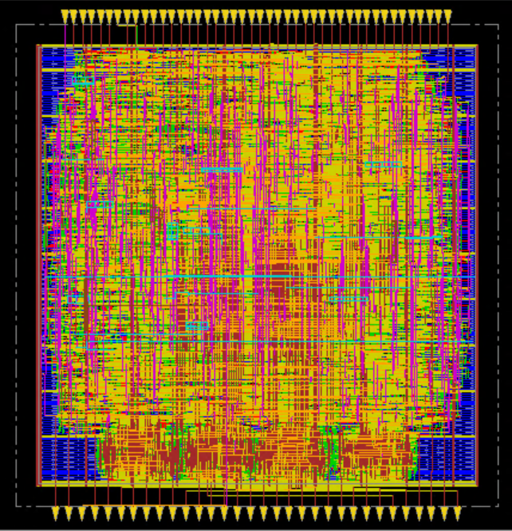
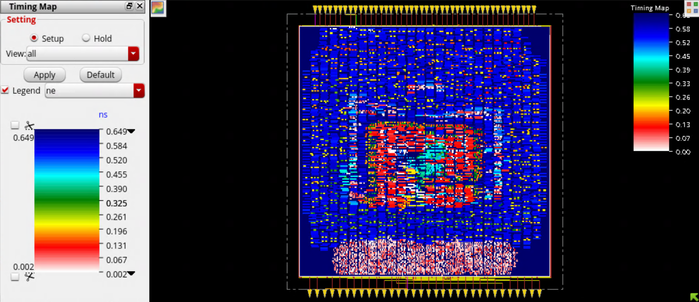
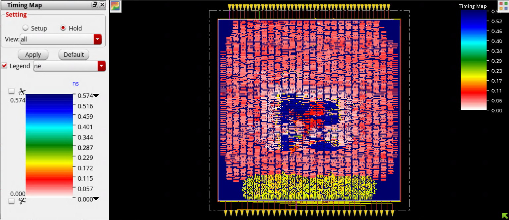
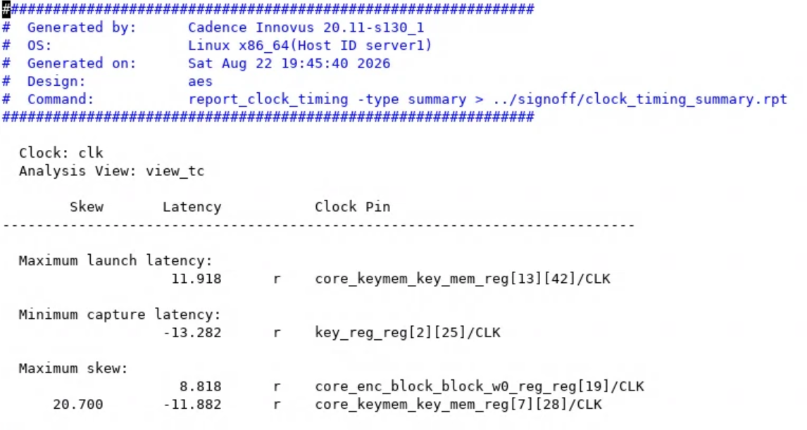
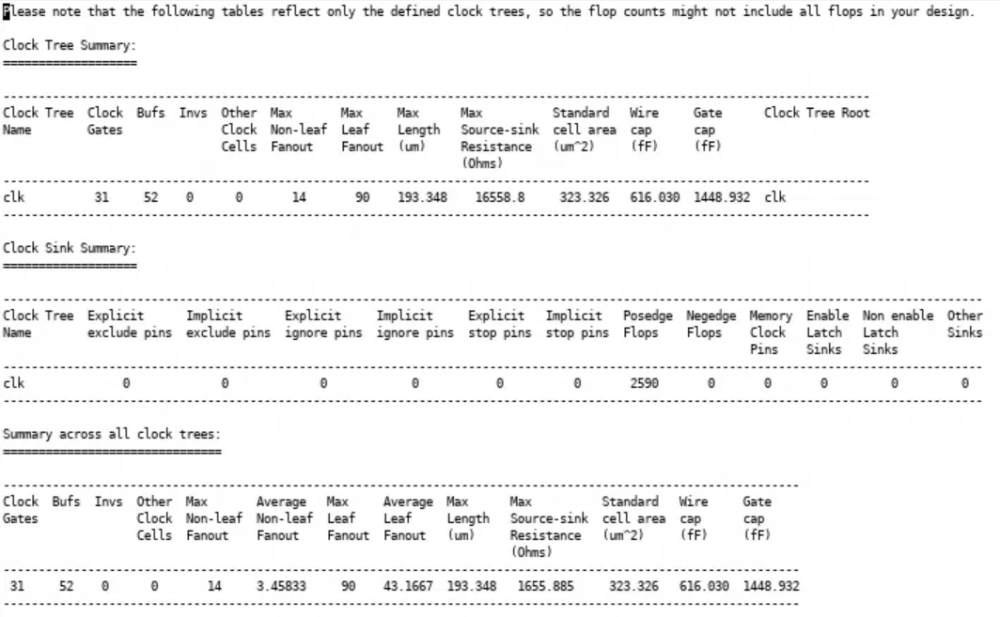

# aes-physical-design-asap7
RTL-to-Routing physical design implementation of an AES core using Cadence Innovus and ASAP7 technology.
# AES Physical Design — RTL to GDSII

Physical design implementation of an AES cryptographic design using Cadence Innovus and ASAP7 technology.

## Tools & Technology

- Verilog
- Cadence Innovus 20.11
- ASAP7 Technology
- Tcl
- Linux

## Physical Design Flow

RTL → Synthesis → Floorplan → Power Planning → Placement → CTS → Routing → Signoff

---

## 1. Floorplan

Initial floorplan with IO placement.



---

## 2. Placement

Standard-cell placement after placement optimization.




---

## 3. Power Planning

Power distribution network with power rings and stripes.



---

## 4. Clock Tree Synthesis

Clock tree implementation and clock distribution.


### Clock Tree Debugger


---

## 5. Routing

Post-route physical implementation.



---

# Signoff Analysis

## Setup Timing



## Hold Timing



## Clock Timing Summary



## Clock Tree Summary



---

## Key Results

| Metric | Result |
|---|---:|
| Technology | ASAP7 |
| Tool | Cadence Innovus 20.11 |
| Standard Cells | 7,550 |
| Nets | 7,695 |
| Sequential Elements | 2,590 |
| Clock Gates | 31 |
| Clock Buffers | 52 |
| Clock Period | 700 ps |
| Target Frequency | ~1.43 GHz |
| Setup WNS | +1.836 ps |
| Setup TNS | 0 ps |
| Setup Violations | 0 |
| Hold Slack | +0.165 ps |
| Max Clock Skew | 20.700 ps |
| Total Power | 4.083 mW |
| Leakage Power | 0.114 mW |

---

## Project Structure

```text
rtl/          → AES RTL
constraints/  → SDC timing constraints
scripts/      → Innovus Tcl scripts
reports/      → Timing, power and physical reports
screenshots/  → Physical design screenshots
