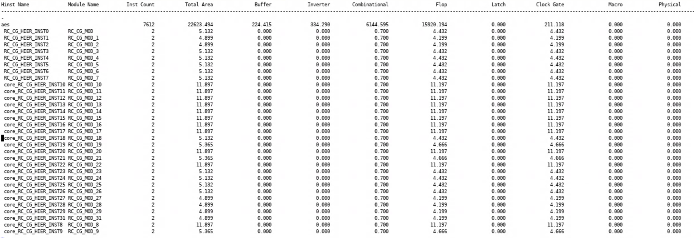
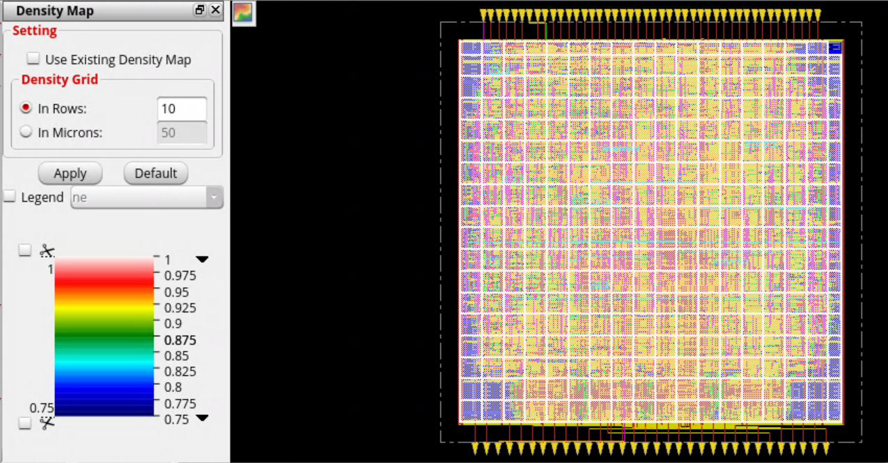

# AES Physical Design — RTL to Post-Route Analysis using Cadence Innovus & ASAP7
> Complete ASIC physical design implementation of an AES cryptographic core from RTL through synthesis, floorplanning, power planning, placement, CTS, routing, and post-route timing and power analysis.
## Project Snapshot

| Parameter | Value |
|---|---|
| Design | AES Cryptographic Core |
| RTL Source | Secworks AES |
| Technology | ASAP7 |
| Tool | Cadence Innovus 20.11 |
| Flow | RTL → Post-Route Analysis |
| Clock Period | 700 ps |
| Target Frequency | ~1.43 GHz |
| Standard Cells | 7,550 |
| Sequential Elements | 2,590 |
| Nets | 7,695 |


<p align="center">
  
</p>

<h3 align="center">
  ASIC Physical Design Implementation of an AES Cryptographic Core
</h3>

<p align="center">
  RTL → Synthesis → Floorplan → Power Planning → Placement → CTS → Routing → Post-Route Analysis
</p>

---

## Table of Contents

- [Introduction](#introduction)
- [Project Objectives](#project-objectives)
- [Source RTL](#source-rtl)
- [Tools and Technology](#tools-and-technology)
- [Design Information](#design-information)
- [Physical Design Flow](#physical-design-flow)
- [1. Floorplanning](#1-floorplanning)
- [2. Power Planning](#2-power-planning)
- [3. Placement](#3-placement)
- [4. Pre-CTS Optimization](#4-pre-cts-optimization)
- [5. Clock Tree Synthesis](#5-clock-tree-synthesis)
- [6. Routing](#6-routing)
- [7. Post-Route Timing Analysis](#7-post-route-timing-analysis)
- [8. Power Analysis](#8-power-analysis)
- [9. Design Statistics](#9-design-statistics)
- [Physical Design Stage Summary](#physical-design-stage-summary)
- [Final Implementation Results](#final-implementation-results)
- [Challenges and Debugging](#challenges-and-debugging)
- [Tcl / Innovus Implementation](#tcl--innovus-implementation)
- [Project Structure](#project-structure)
- [Skills Demonstrated](#skills-demonstrated)
- [ASAP7 Standard Cell Views](#asap7-standard-cell-views)
- [Reproducibility](#reproducibility)
- [Reference](#reference)
- [Conclusion](#conclusion)

---

# Introduction

This project demonstrates the **ASIC physical design implementation of an AES cryptographic core**, starting from Verilog RTL and progressing through synthesis, floorplanning, power planning, placement, clock tree synthesis, routing, and post-route timing and power analysis.

The AES RTL used as the starting point for this project is based on the open-source **Secworks AES** implementation.

The primary focus of this project is **physical design implementation and analysis**, rather than development of the AES RTL itself.

The design was implemented using **Cadence Innovus** with the **ASAP7 technology library**.

The project covers the complete backend implementation flow from RTL through **post-route timing analysis**, with physical implementation results documented using screenshots, reports, and design statistics.

### Project Scope

```text
AES RTL
   │
   ▼
Synthesis
   │
   ▼
Floorplanning
   │
   ▼
Power Planning
   │
   ▼
Placement
   │
   ▼
Pre-CTS Optimization
   │
   ▼
Clock Tree Synthesis
   │
   ▼
Routing
   │
   ▼
Post-Route Timing Analysis
   │
   ├── Setup Analysis
   ├── Hold Analysis
   ├── Clock Analysis
   ├── Area Analysis
   └── Power Analysis
```
---

# Project Objectives

The main objectives of this project were:

Implement an existing AES RTL design through an ASIC physical design flow.
Perform synthesis and generate the gate-level implementation.
Create and verify the physical floorplan.
Implement the power distribution network.
Perform standard-cell placement and optimization.
Perform Clock Tree Synthesis (CTS).
Perform global and detailed routing.
Analyze post-route setup timing.
Analyze post-route hold timing.
Analyze clock skew and clock distribution.
Analyze area and placement density.
Analyze power consumption and leakage.
Generate physical design reports using Cadence Innovus.
Use Tcl scripting to automate the physical design flow.
Understand the effect of each physical design stage on timing, power, area, and congestion.

---

# Source RTL

The AES RTL used in this project is based on the open-source Secworks AES project.

Source Repository

https://github.com/secworks/aes/tree/master/src/rtl

The RTL source contains modules including:

aes.v
aes_core.v
aes_encipher_block.v
aes_decipher_block.v
aes_key_mem.v
aes_sbox.v
aes_inv_sbox.v

---

## Project Scope

The AES RTL architecture was not developed as part of this project.

The contribution of this project is the ASIC physical design implementation of the AES RTL, including:

```text
RTL
 ↓
Synthesis
 ↓
Floorplanning
 ↓
Power Planning
 ↓
Placement
 ↓
Pre-CTS Optimization
 ↓
Clock Tree Synthesis
 ↓
Routing
 ↓
Post-Route Timing Analysis
 ↓
Power Analysis

```
---

# Tools and Technology
| Category             | Tool / Technology     |
| -------------------- | --------------------- |
| HDL                  | Verilog               |
| Physical Design Tool | Cadence Innovus 20.11 |
| Technology           | ASAP7                 |
| Scripting            | Tcl                   |
| Timing Constraints   | SDC                   |
| Operating System     | Linux                 |
| Starting RTL         | Secworks AES          |

---

# Design Information
| Parameter            |                  Value |
| -------------------- | ---------------------: |
| Design               | AES Cryptographic Core |
| RTL Source           |           Secworks AES |
| Technology           |                  ASAP7 |
| Physical Design Tool |  Cadence Innovus 20.11 |
| Clock Period         |                 700 ps |


---
# Design Constraints

The design was constrained using an SDC-based timing environment.

### Clock

| Constraint | Value |
|---|---:|
| Clock Name | `[ADD VALUE]` |
| Clock Port | `[ADD VALUE]` |
| Period | 700 ps |
| Waveform | `[ADD VALUE]` |

### I/O Constraints

| Constraint | Value |
|---|---:|
| Input Delay | `[ADD VALUE]` |
| Output Delay | `[ADD VALUE]` |
| Input Transition | `[ADD VALUE]` |
| Output Load | `[ADD VALUE]` |
| Driving Cell | `[ADD VALUE]` |

--- 

# Physical Design Flow

The design was taken through the following ASIC physical design stages:
```text
                    AES RTL
                       │
                       ▼
                  Synthesis
                       │
                       ▼
                 Floorplanning
                       │
                       ▼
                Power Planning
                       │
                       ▼
                   Placement
                       │
                       ▼
              Pre-CTS Optimization
                       │
                       ▼
             Clock Tree Synthesis
                       │
                       ▼
                    Routing
                       │
                       ▼
              Post-Route Analysis
                 ┌─────┼─────┐
                 ▼     ▼     ▼
              Timing  Power  Area
```
---
# 1. Floorplanning

Floorplanning establishes the physical boundaries of the design and defines the environment for placement and routing.

### Objectives
Define die and core boundaries.
Set the target core utilization.
Define the core aspect ratio.
Place input and output pins.
Provide sufficient routing resources.
Prepare the design for power planning and placement.
## Floorplan Parameters
| Parameter        |         Value |
| ---------------- | ------------: |
| Die Width        | `[ADD VALUE]` |
| Die Height       | `[ADD VALUE]` |
| Core Width       | `[ADD VALUE]` |
| Core Height      | `[ADD VALUE]` |
| Core Utilization | `[ADD VALUE]` |
| Aspect Ratio     | `[ADD VALUE]` |
## Floorplan with IO Placement
<p align="center">  </p>

---

# 2. Power Planning

A power distribution network (PDN) was created to distribute the VDD and VSS supplies across the design.

The power network consists of power rings and power stripes connected to the standard-cell power rails.

### Objectives
Provide reliable VDD/VSS distribution.
Connect standard-cell power rails to the global power network.
Provide sufficient current-carrying capability.
Maintain power connectivity throughout the core.
Reduce IR-drop and electromigration risk.
Verify power-via connectivity.
## Power Network Configuration
| Parameter        | Value         |
| ---------------- | ------------- |
| Power Nets       | VDD / VSS     |
| Ring Layers      | `[ADD VALUE]` |
| Stripe Layers    | `[ADD VALUE]` |
| Stripe Width     | `[ADD VALUE]` |
| Stripe Spacing   | `[ADD VALUE]` |
| Stripe Pitch     | `[ADD VALUE]` |
| Stripe Direction | `[ADD VALUE]` |

## Power Grid
<p align="center">  </p>

---
# 3. Placement

Standard cells were placed within the defined core area.

Placement attempts to achieve a balance between:

Timing
Placement density
Routing congestion
Wirelength
Routability
### Placement Objectives
Achieve legal standard-cell placement.
Optimize critical timing paths.
Maintain acceptable placement density.
Reduce routing congestion.
Prepare the design for CTS and routing.

## Placement
<p align="center">  </p> 

## Placement with Virtual Routing

Virtual routing was used to evaluate the quality of the placement and estimate interconnect effects before actual routing.

<p align="center">  </p>

---

# 4. Pre-CTS Optimization

Pre-CTS optimization was performed after placement and before Clock Tree Synthesis.

The purpose of this stage is to improve the physical and timing quality of the design before introducing the clock network.

### Objectives
Improve setup timing.
Optimize critical paths.
Reduce congestion.
Improve placement quality.
Prepare the design for CTS.

## Pre-CTS Result
<p align="center">  </p>

---

# 5. Clock Tree Synthesis

Clock Tree Synthesis (CTS) was performed to distribute the clock signal from the clock source to the sequential elements.

The primary objectives of CTS are to control:

Clock skew
Clock latency
Clock transition
Clock insertion delay
Clock-tree power

### CTS Objectives
Build a balanced clock distribution network.
Minimize clock skew.
Control clock latency.
Maintain acceptable clock transition.
Meet setup and hold timing requirements.

## CTS Implementation
<p align="center">  </p>

## Clock Timing Summary
<p align="center">  </p>

## Clock Tree Summary
<p align="center">  </p>

## Clock Tree Debugger
The clock tree was inspected after CTS to analyze clock distribution, skew, and latency.
<p align="center">  </p>

## CTS Results
| Metric             |        Result |
| ------------------ | ------------: |
| Clock Period       |        700 ps |
| Clock Buffers      |            52 |
| Clock Gates        |            31 |
| Maximum Clock Skew |     20.700 ps |
| Clock Latency      | `[ADD VALUE]` |
| Clock Transition   | `[ADD VALUE]` |

---

# 6. Routing

After CTS, the design was routed using global and detailed routing.

Routing establishes the physical interconnections between the placed standard cells, clock network, IOs, and other design components.

### Routing Objectives
Complete all signal connections.
Maintain design-rule compliance.
Minimize routing congestion.
Preserve timing quality.
Account for post-route parasitic effects.

## Routed Design
<p align="center">  </p>

## Setup Timing Map After Routing
<p align="center">  </p>

## Hold Timing Map After Routing
<p align="center">  </p>

## Routing Results
| Metric                  |        Result |
| ----------------------- | ------------: |
| Routing Status          | `[ADD VALUE]` |
| DRC Violations          | `[ADD VALUE]` |
| Routing Violations      | `[ADD VALUE]` |
| Worst Congestion        | `[ADD VALUE]` |
| Global Routing Overflow | `[ADD VALUE]` |

---

# 7. Post-Route Timing Analysis

Post-route Static Timing Analysis (STA) was performed after routing to evaluate the final timing behavior of the implemented design.

Both setup and hold timing were analyzed.

## 7.1 Setup Timing

Setup analysis verifies that data reaches the receiving sequential element before the required capture clock edge.

### Setup Results
| Metric                     |        Result |
| -------------------------- | ------------: |
| Clock Period               |        700 ps |
| Worst Negative Slack (WNS) |     +1.836 ps |
| Total Negative Slack (TNS) |          0 ps |
| Setup Violations           |             0 |
| Critical Path Delay        | `[ADD VALUE]` |
| Critical Path Startpoint   | `[ADD VALUE]` |
| Critical Path Endpoint     | `[ADD VALUE]` |

## Setup Timing Report
<p align="center">  </p>

---

## 7.2 Hold Timing

Hold analysis verifies that data does not arrive too early at the receiving sequential element after the active clock edge.

### Hold Results
Metric	Result
Worst Hold Slack	+0.165 ps
Hold Violations	0
Critical Hold Path	[ADD VALUE]

## Hold Timing Report
<p align="center">  </p>

## 7.3 Timing Summary
<p align="center">  </p>

### Final Timing Summary
| Metric             |    Result |
| ------------------ | --------: |
| Clock Period       |    700 ps |
| Target Frequency   | ~1.43 GHz |
| Setup WNS          | +1.836 ps |
| Setup TNS          |      0 ps |
| Setup Violations   |         0 |
| Hold Slack         | +0.165 ps |
| Hold Violations    |         0 |
| Maximum Clock Skew | 20.700 ps |

### Timing Conclusion

The final post-route implementation achieved positive setup and hold slack for the analyzed timing conditions.

---

# 8. Power Analysis

Power analysis was performed on the implemented design to evaluate the power consumption of the AES core.

The analysis includes:

Internal power
Switching power
Leakage power
Total power

## 8.1 Total Power
<p align="center">  </p>

## 8.2 Leakage Power
<p align="center">  </p>

## 8.3 Power Distribution
<p align="center">  </p>

## Power Results
| Metric          |        Result |
| --------------- | ------------: |
| Total Power     |      4.083 mW |
| Leakage Power   |      0.114 mW |
| Internal Power  | `[ADD VALUE]` |
| Switching Power | `[ADD VALUE]` |

---

# 9. Design Statistics

Design statistics were collected from the physical implementation to evaluate the area, utilization, placement density, and design composition.

## 9.1 Area Breakdown
<p align="center">  </p>

## 9.2 Placement Density
<p align="center">  </p>

## 9.3 Design Browser
<p align="center">  </p>

## 9.4 Design Statistics

| Metric              |        Result |
| ------------------- | ------------: |
| Standard Cells      |         7,550 |
| Sequential Elements |         2,590 |
| Nets                |         7,695 |
| Clock Gates         |            31 |
| Clock Buffers       |            52 |
| Total Cell Area     | `[ADD VALUE]` |
| Core Area           | `[ADD VALUE]` |
| Utilization         | `[ADD VALUE]` |
| Placement Density   | `[ADD VALUE]` |

---

# Physical Design Stage Summary
| Stage                | Why It Is Performed                | Main Checks                             |
| -------------------- | ---------------------------------- | --------------------------------------- |
| Synthesis            | Convert RTL into gate-level logic  | Cell count, area, timing                |
| Floorplanning        | Define physical boundaries         | Utilization, aspect ratio, IO placement |
| Power Planning       | Build VDD/VSS distribution         | Rings, stripes, vias                    |
| Placement            | Physically position standard cells | Density, timing, congestion             |
| Pre-CTS Optimization | Improve design before CTS          | Setup timing, congestion                |
| CTS                  | Build clock distribution network   | Skew, latency, transition               |
| Routing              | Create physical connections        | Congestion, DRC, timing                 |
| Post-Route STA       | Verify final timing                | WNS, TNS, setup, hold                   |
| Power Analysis       | Analyze power consumption          | Internal, switching, leakage            |
| Design Statistics    | Evaluate physical implementation   | Area, utilization, density              |

---

# Final Implementation Results

## Implementation Summary
| Metric              |                Result |
| ------------------- | --------------------: |
| Technology          |                 ASAP7 |
| Tool                | Cadence Innovus 20.11 |
| Standard Cells      |                 7,550 |
| Sequential Elements |                 2,590 |
| Nets                |                 7,695 |
| Clock Gates         |                    31 |
| Clock Buffers       |                    52 |
| Clock Period        |                700 ps |
| Target Frequency    |             ~1.43 GHz |

## Timing Summary
| Metric             |    Result |
| ------------------ | --------: |
| Setup WNS          | +1.836 ps |
| Setup TNS          |      0 ps |
| Setup Violations   |         0 |
| Hold Slack         | +0.165 ps |
| Hold Violations    |         0 |
| Maximum Clock Skew | 20.700 ps |

## Power Summary
| Metric          |        Result |
| --------------- | ------------: |
| Total Power     |      4.083 mW |
| Leakage Power   |      0.114 mW |
| Internal Power  | `[ADD VALUE]` |
| Switching Power | `[ADD VALUE]` |

## Physical Summary
| Metric            |        Result |
| ----------------- | ------------: |
| Core Utilization  | `[ADD VALUE]` |
| Placement Density | `[ADD VALUE]` |
| Total Cell Area   | `[ADD VALUE]` |
| Core Area         | `[ADD VALUE]` |
| Worst Congestion  | `[ADD VALUE]` |
| DRC Violations    | `[ADD VALUE]` |

---

# Challenges and Debugging

Physical design is an iterative process. During implementation, physical, timing, and connectivity issues were analyzed and debugged.

## Power-Via Connectivity

Power-via connectivity was checked during power planning to verify proper connections between the power-routing layers.

### Debugging Process
```text
Power Planning
      ↓
Power Via Check
      ↓
Identify Connectivity Issues
      ↓
Review Power Ring / Stripe Configuration
      ↓
Modify Power Network
      ↓
Re-run Verification
```
The power network was iteratively checked to ensure proper connectivity before proceeding with subsequent implementation stages.

## Timing Debugging

Timing was analyzed after major implementation stages to identify setup and hold issues.

### Debugging Process
```text
Generate Timing Report
        ↓
Identify Critical Path
        ↓
Analyze Slack
        ↓
Check Cell / Net Delay
        ↓
Optimize Implementation
        ↓
Re-run Timing Analysis
```
Both setup and hold timing were analyzed during the implementation flow.

## Congestion Analysis
Routing congestion was monitored to ensure that the placement remained routable.

The congestion analysis involved:

Inspecting congestion maps.
Identifying high-density regions.
Evaluating placement density.
Reviewing routing resources.
Optimizing placement where required.
Re-evaluating routing quality.

---
# Tcl / Innovus Implementation

The physical design flow was controlled using Tcl scripts in Cadence Innovus.

The scripts were used to automate:

Library setup
Design initialization
Floorplanning
IO placement
Power planning
Placement
Optimization
CTS
Routing
Timing analysis
Power analysis
Report generation

## Flow Organization
```text
Initialization
     ↓
Floorplan
     ↓
Power Plan
     ↓
Placement
     ↓
Pre-CTS Optimization
     ↓
CTS
     ↓
Routing
     ↓
Timing Analysis
     ↓
Power Analysis
```
# Project Structure
```text
aes-physical-design-asap7/
│
├── rtl/
│   └── AES RTL source files
│
├── constraints/
│   └── SDC timing constraints
│
├── scripts/
│   └── Innovus Tcl scripts
│
├── reports/
│   ├── timing/
│   ├── power/
│   ├── area/
│   └── physical/
│
├── screenshots/
│   │
│   ├── 01_floorplan/
│   │   └── floorplan_io.png
│   │
│   ├── 02_powerplanning/
│   │   └── power_grid.png
│   │
│   ├── 03_placement/
│   │   ├── placement.png
│   │   └── placement1.png
│   │
│   ├── 04_prects/
│   │   └── prects.png
│   │
│   ├── 05_cts/
│   │   ├── cts.png
│   │   ├── clock_timing_summary.png
│   │   ├── clock_tree_debugger.png
│   │   └── clock_tree_summary.png
│   │
│   ├── 06_routing/
│   │   ├── routed_design.png
│   │   ├── setup_timing_map.png
│   │   └── hold_timing_map.png
│   │
│   ├── 07_timing_analysis/
│   │   ├── setup.png
│   │   ├── hold.png
│   │   └── timing_summary.png
│   │
│   ├── 08_power_analysis/
│   │   ├── total_power.png
│   │   ├── leakage_power.png
│   │   └── power_distribution.png
│   │
│   ├── 09_design_statistics/
│   │   ├── area_breakdown.png
│   │   ├── density_map.png
│   │   └── design_browser.png
│   │
│   └── asap7_cell_views/
│       ├── AND2X2_ASAP7.png
│       ├── AND3X1_ASAP7.png
│       ├── DFF_ASAP7.png
│       ├── FULL_ADDER_ASAP7.png
│       ├── HALF_ADDER_ASAP7.png
│       ├── ICG_ASAP7.png
│       ├── NAND3X2_ASAP7.png
│       ├── NOR_ASAP7.png
│       ├── OAI_ASAP7.png
│       ├── OR_ASAP7.png
│       ├── XNOR_ASAP7.png
│       └── XOR_ASAP7.png
│
└── README.md
```

# Skills Demonstrated

## Physical Design
RTL-to-GDSII implementation flow
Floorplanning
IO placement
Power planning
Standard-cell placement
Placement optimization
Clock Tree Synthesis
Clock skew analysis
Clock latency analysis
Global routing
Detailed routing
Congestion analysis
Physical verification

## Static Timing Analysis
SDC constraints
Clock constraints
Setup timing
Hold timing
WNS
TNS
Critical path analysis
Clock skew
Post-route timing analysis

## Power Analysis
Internal power
Switching power
Leakage power
Total power
Power distribution analysis

## Automation
Tcl scripting
Cadence Innovus automation
Linux-based ASIC flow
Report generation
Physical-design debugging

###Key Physical Design Concepts Demonstrated

| Concept                    | Demonstrated Through            |
| -------------------------- | ------------------------------- |
| Floorplan Utilization      | Floorplan and density analysis  |
| IO Placement               | Initial floorplan               |
| Power Distribution Network | Power rings and stripes         |
| Placement Density          | Density map                     |
| Congestion                 | Routing and congestion analysis |
| Clock Skew                 | CTS analysis                    |
| Clock Latency              | Clock tree analysis             |
| Setup Timing               | Post-route STA                  |
| Hold Timing                | Post-route STA                  |
| WNS / TNS                  | Timing reports                  |
| Power                      | Post-route power analysis       |
| Tcl Automation             | Innovus implementation scripts  |

---

# ASAP7 Standard Cell Views

The repository also contains layout views of selected ASAP7 standard cells.
<table>
  <tr>
    <td align="center">
      <b>AND2X2</b><br>
      
    </td>
    <td align="center">
      <b>AND3X1</b><br>
      
    </td>
    <td align="center">
      <b>DFF</b><br>
      
    </td>
    <td align="center">
      <b>Full Adder</b><br>
      
    </td>
  </tr>

  <tr>
    <td align="center">
      <b>Half Adder</b><br>
      
    </td>
    <td align="center">
      <b>Integrated Clock Gating</b><br>
      
    </td>
    <td align="center">
      <b>NAND3X2</b><br>
      
    </td>
    <td align="center">
      <b>NOR2X2</b><br>
      
    </td>
  </tr>

  <tr>
    <td align="center">
      <b>OAI321X</b><br>
      
    </td>
    <td align="center">
      <b>OR2X6</b><br>
      
    </td>
    <td align="center">
      <b>NOR2X5</b><br>
      
    </td>
    <td align="center">
      <b>XNOR2X1</b><br>
      
    </td>
  </tr>
</table>

# Reproducibility
## Requirements
Linux environment
Cadence Innovus
ASAP7 technology and standard-cell libraries
Verilog RTL
SDC timing constraints
Tcl
### Clone Repository
```text
git clone https://github.com/Vineeth-2k4/aes-physical-design-asap7.git
cd aes-physical-design-asap7
```
The required Cadence libraries, technology files, and other proprietary files must be configured separately in the implementation environment.
```text
Cadence EDA tools and proprietary technology/library files are not included in this repository.
```
# Reference
## AES RTL

The starting RTL for this physical-design project is based on:

## Secworks AES

https://github.com/secworks/aes/tree/master/src/rtl

The Secworks repository provides the AES RTL implementation used as the starting point for this physical-design project.

# Conclusion

This project demonstrates the physical implementation of an AES cryptographic core starting from an existing Verilog RTL implementation and progressing through post-route timing and power analysis.

The complete physical design flow covered:
```text 
RTL
 ↓
Synthesis
 ↓
Floorplanning
 ↓
Power Planning
 ↓
Placement
 ↓
Pre-CTS Optimization
 ↓
Clock Tree Synthesis
 ↓
Routing
 ↓
Post-Route Timing Analysis
 ↓
Power Analysis
 ↓
Design Statistics
```
The final implementation was analyzed for:

Area
Utilization
Placement density
Congestion
Clock skew
Setup timing
Hold timing
WNS
TNS
Total power
Leakage power

The project provides practical experience with:

Cadence Innovus • ASAP7 • Tcl • Floorplanning • Power Planning • Placement • CTS • Routing • Post-Route STA • Power Analysis • Physical Design Debugging

---

## Final Physical Implementation

<p align="center">
  
</p>


